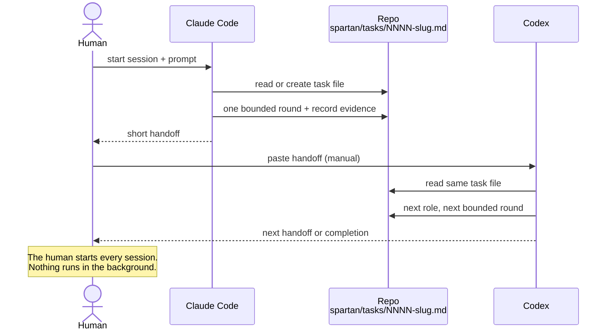

# Agent Spartan Protocol

> Move work between coding agents without copying the whole conversation — or building an orchestrator.

**The human is the orchestrator. The repo is the memory. Markdown is the protocol.**

Hand off coding tasks between Claude Code, Codex, and any agent — with one Markdown file and one paste. Agent Spartan Protocol is a portable, human-mediated handoff protocol for software work performed across authenticated coding-agent hosts: one repository-local Markdown task artifact preserves context, and one concise prompt transfers the next bounded action.

The protocol is intentionally not an orchestrator. It does not launch models, manage credentials, keep a daemon alive, retry work, monitor sessions, coordinate concurrency, or adopt patches automatically.

## How a handoff works



## Quick start

### Claude Code

Add the marketplace once, then install the plugin:

```text
/plugin marketplace add angelopublio/agent-spartan-protocol
/plugin install spartan@agent-spartan-protocol
```

Invoke it in any project with `/spartan:spartan` (or simply `/spartan` when no other command uses that name):

```text
/spartan:spartan

Implement a small, reversible change that fixes the empty-state message and updates the relevant regression test.
```

### Codex and other agents

Install with the [skills CLI](https://github.com/vercel-labs/skills), which detects your installed agents (Codex, Cursor, and many others):

```bash
npx skills add angelopublio/agent-spartan-protocol --skill spartan
```

Invoke it in Codex by mentioning the skill:

```text
Use `$spartan`.

Implement a small, reversible change that fixes the empty-state message and updates the relevant regression test.
```

Either way, Spartan creates or continues one task file under `spartan/tasks/` in your project, performs one bounded round, and returns one short handoff you can paste into the next host. You choose and start every next session; nothing runs in the background.

## Why it exists

Coding agents already know how to inspect repositories, edit files, run checks, and review diffs. The missing piece is a small, durable contract that lets a human move work between hosts without copying the full conversation or building an execution platform.

Spartan provides that contract:

1. The current host reads or creates `spartan/tasks/NNNN-<slug>.md`.
2. It performs one useful, bounded round.
3. It records decisions, work, concise evidence, blockers, and the next action.
4. It returns one short English handoff referencing the task file.
5. The human chooses and starts the next host.

## Authorities

- Repository files, the current diff, and check results are the truth of implementation.
- The task Markdown is the truth of handoff.
- Chat history is disposable context.
- `spartan/tasks/` remains public and version-controlled as living proof that the protocol can carry real work without hidden state.

Phase and status fields describe the current snapshot. They are not an executable state machine. The task file is not an event log, database, audit ledger, or transcript.

## Package

The portable skill lives in [`agent-skill/`](agent-skill/):

```text
agent-skill/
|- .claude-plugin/
|  `- plugin.json
|- CHANGELOG.md
|- version.txt
|- SKILL.md
|- agents/
|  `- openai.yaml
|- references/
|  |- protocol.md
|  `- routing.md
`- assets/
   `- task-template.md
```

`agents/openai.yaml` is optional Codex interface metadata. The behavior contract remains in portable Markdown shared by all hosts.

Distribution metadata is static only: `.claude-plugin/marketplace.json` at the repository root lists the plugin for Claude Code, and `agent-skill/.claude-plugin/plugin.json` carries the package's passive Semantic Version. Neither adds runtime behavior, and the skills CLI needs nothing beyond `SKILL.md`.

Project-local discovery uses symbolic links to the same source folder:

```text
.agents/skills/spartan -> ../../agent-skill
.claude/skills/spartan -> ../../agent-skill
```

Codex uses the `.agents` link, Claude Code uses the `.claude` link, and compatible hosts may use the same canonical source. These links install no runtime and create no divergent skill copies.

## Use the Agent Spartan Protocol inside a project

Start the coding host with the target project as its working folder. Spartan stores continuation state in that target project under `spartan/tasks/`; it does not store the target project's task state in this protocol repository. The `spartan/README.md` file explains this durable task namespace.

When Spartan creates that first task in a repository whose root has neither an `AGENTS.md` nor a `CLAUDE.md`, the round also adds one advisory line suggesting you create an `AGENTS.md` (stack, dev/build/lint/test commands, conventions) plus a minimal `CLAUDE.md` that points to it, so later hosts start with shared instructions to read. The suggestion is tied to the repository's first task — it fires once, with no hidden flag — and Spartan never writes those files for you. You decide whether to add them.

To continue an existing task in either host, reference its exact artifact instead of repeating its history:

```text
Open `spartan/tasks/NNNN-<slug>.md`.

Act as the next role recorded in the task, perform its one bounded next action, update the same task file, and return only the next handoff or a completion notice.
```

The human must start every new host session and manually transfer every handoff. Spartan never opens or invokes another platform.

## Releases

The installable package uses Semantic Versioning. Release automation lives in repository CI, outside `agent-skill/`; it prepares the changelog and package metadata, then creates the tag and GitHub Release after its release pull request is merged. See [`RELEASING.md`](RELEASING.md) for the operator flow.

The `protocol` value copied into a newly created task is only a birth-stamp. Spartan performs no version negotiation or network check, and package releases never rewrite existing tasks or version an adopting repository.

## Non-goals

This project does not provide:

- cross-provider model invocation;
- API-key or subscription management;
- workers, daemons, schedulers, polling, or crash recovery;
- queues, locks, concurrency control, or worktree allocation;
- automatic retries or correction loops;
- secret scanners, sandboxes, or policy engines;
- event ledgers, projections, patch digests, or transactional adoption;
- external actions initiated automatically by Spartan, such as commit, push, pull request, merge, or deployment. Repository release CI is separate from the portable protocol and its installable package.

If a requirement needs those guarantees, it belongs in a separate runtime or workbench rather than this protocol.

## Portability test

The decisive test is deletion:

> If the skill is removed, do the task files remain understandable, and can a human continue the work manually?

If the answer is no, the feature has crossed from protocol into runtime.

This is Steph Ango's [file over app](https://stephango.com/file-over-app), applied to models: the task file must outlive every host that touched it.

## Development / fallback install

Working on the protocol itself, or on a host that cannot use the marketplace or the skills CLI? See [`docs/INSTALL-DEV.md`](docs/INSTALL-DEV.md) for the symlink-based installation.

## Current status

The current release is always the latest entry on the [GitHub Releases page](https://github.com/angelopublio/agent-spartan-protocol/releases); the packaged version is recorded in `agent-skill/version.txt` and bumped only by the release automation, which has been exercised end to end (see the completed [`spartan/tasks/0008-verify-first-hosted-release.md`](spartan/tasks/0008-verify-first-hosted-release.md)). The validated static-package baseline and its bootstrap approvals are recorded in [`spartan/tasks/0001-bootstrap-v0-1.md`](spartan/tasks/0001-bootstrap-v0-1.md).

The next phase is real-project dogfooding: one small reversible task completed in one host, one material change with fresh-context review, and one high-impact plan or review handed manually across vendors. Do not add protocol features until repeated trial evidence justifies them.

See [`docs/DOGFOODING.md`](docs/DOGFOODING.md) for the sequence and exit criteria.
